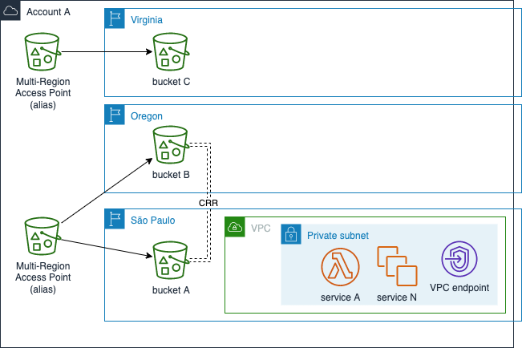
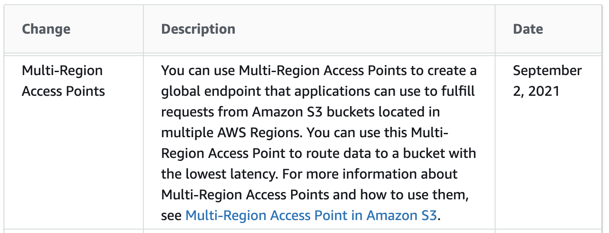

**Solution Scenario: Seamless Multi Region access to Amazon S3**

When trying to access a remote bucket from another region, you might have faced with the following error message:

*The bucket you are attempting to access must be addressed using the specified endpoint. Please send all future requests to this endpoint.*

AWS released a new feature to deal with remote access to buckets replicated or not in different regions from the client application providing better latency and support for disaster recovery scenarios.

https://docs.aws.amazon.com/AmazonS3/latest/userguide/WhatsNew.html

MRAP (Multi Region Access Points) can be accessed either directly via public internet routing or via private endpoint using a specific Interface Endpoint for Multi-region access point. 
By leveraging this private setup, it is possible to offer better security to access your buckets without traversing the internet. It is also possible to control from where your buckets can be acessed through VPC endpoint resource policy.

https://aws.amazon.com/blogs/storage/managing-amazon-s3-access-with-vpc-endpoints-and-s3-access-points/